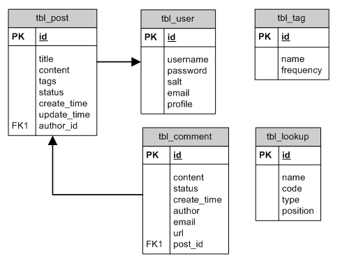

# 28Mansion-Backend
Server-Side of 28Mansion Web Application. related stacks are NodeJs/Typescrpt. TDD as a methodology of development.

## API Documentation [link](https://socialmedia-28mansion.herokuapp.com/)
## How to run this application

clone repository
```bash
 git clone https://github.com/alailsonko/28Mansion-Backend.git
```

install dependencies
```bash
yarn
```

start the app
```bash
yarn dev:server
```
## Database Model

